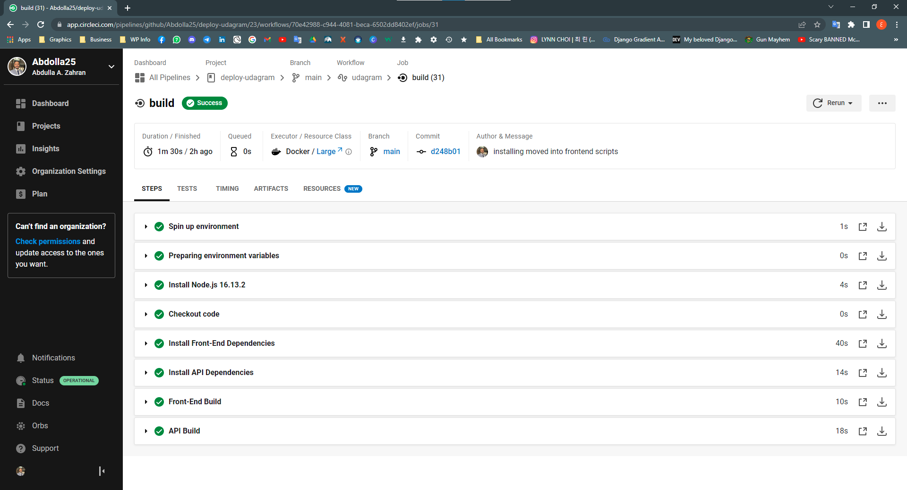
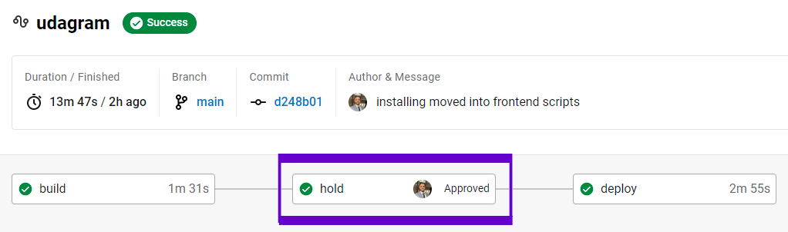
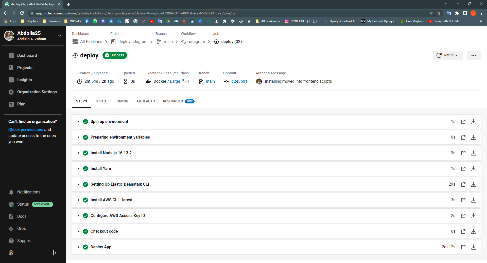
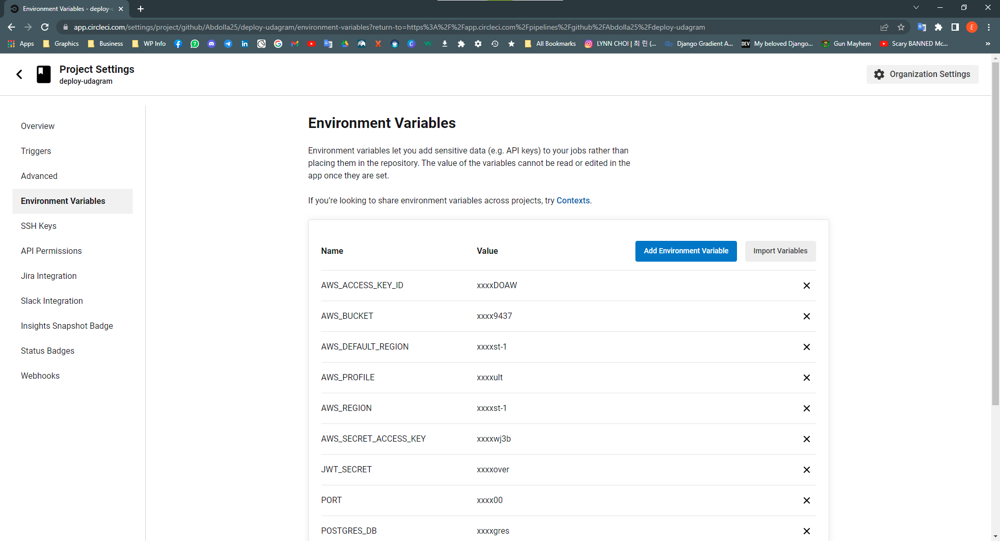

# Pipeline Process

In this project using circleci to automate the process of deployment effectively that triggers with GitHub commits.

## Continuous Integration | CI

Continuous integration is a group of many steps in our pipeline.

The goal of continuous integration is to verify if code is ready to be merged when a pull request is submitted or to see if code is ready and safe to be deployed.

By installing dependencies and testing the code, we are building confidence that our application is ready to be deployed.

*Our application has been built successfully, we could add some tests also...*

## Continuous Delivery / Continuous Deployment | CD

Continuous delivery or continuous deployment are both steps that we refer to when talking about the D of CI/CD. Both have as a goal to get the application from the build stage and move it to its destination. 

*Now, we have verified that our application is ready for deployment...*

*Our application has been deployed successfully on AWS...*

## Pipeline Environment Variables

circleci provides a good way to pass secret information, here's an example of `Environment Variables`:

